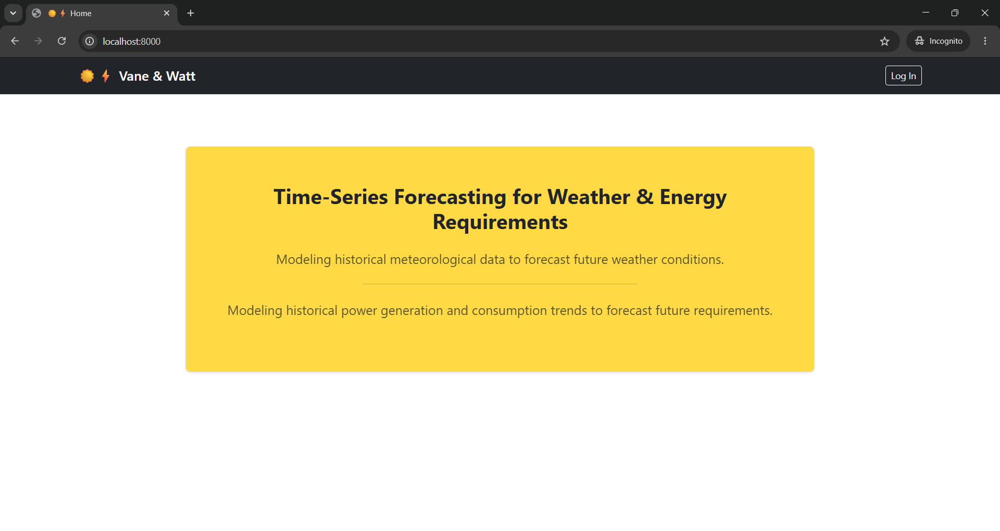
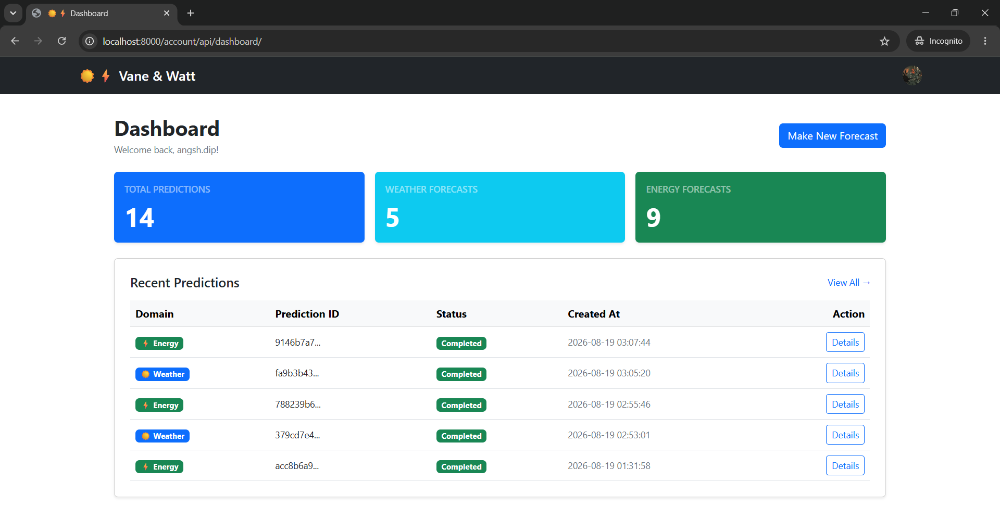

<h1 style="text-align:center; font-weight:bold;">☀️ Vane & Watt ⚡</h1>

End-to-end Django web app for forecasting next day energy generation/consumption and next 4 day weather trends. Secured with JWT-based authentication and Role-Based Access Control (RBAC). Forecast results are sent to registered users via e-mail alerts.

<table style="margin-left:auto; margin-right:auto;">
    <tbody>
        <tr>
            <td style="text-align:center; font-weight:bold;">Home Page</td>
        </tr>
        <tr>
            <td style="text-align:center;">
                
            </td>
        </tr>
        <tr>
            <td style="text-align:center; font-weight:bold;">Dashboard</td>
        </tr>
        <tr>
            <td style="text-align:center;">
                
            </td>
        </tr>
    </tbody>
</table>

---

## 🚀 Tech Stack

**Django** - For ORM, database migrations, middleware, rendering server-side HTML templates.

**DRF (Django REST Framework)** - For building API endpoints for inferencing and profile management, JWT-based authentication, and Role-Based Access Control (RBAC).

**PostgreSQL** - Database for storing user and inferencing data.

**Celery** - For asynchronously managing heavy ML inferences and e-mail alerts off the main thread so the app never freezes.

**Redis** - Fast, in-memory message broker that stores and passes task queues between Django and Celery background workers.

**TensorFlow** - To build and fit LSTM networks on the weather dataset.

**XGBoost** - To build and fit gradient boosting regressors on the energy dataset.

**Pandas** - For data preprocessing and feature engineering.

**scikit-learn** - For scaling data and evaluating performance metrics.

**Matplotlib** - For plotting boxplots, data distributions, loss curves, etc. and visualizing performance metrics for comparison.

**Jupyter notebooks** - For performing experiments, documenting results, and exporting training artifacts.

**Jinja templates and Bootstrap** - For rendering responsive HTML templates and styling the app.

**GMail SMTP server** - For sending e-mail alerts to registered users asynchronously.

**Docker** - For containerizing the app and its dependencies for easy and platform-agnostic deployment.

---

## ✨ Features

✅ _Multi-variable weather forecasting_ over a _4-day horizon_ using LSTM networks.

✅ _Energy generation/consumption prediction_ over a _1-day horizon_ using XGBoost regressors.

✅ _User registration and authentication_ with JWT-based tokens and Role-Based Access Control (RBAC) for secure access to the app.

✅ _Asynchronous inferencing_ using Celery and Redis to avoid freezing the app during heavy ML computations.

✅ _E-mail alerts_ sent to registered users with inferencing results using Google's SMTP server.

✅ _Dashboard_ for making inferences and viewing history of previous predictions.

✅ _Dockerized_ for easy deployment.

---

## 📉 Experiment Results

Several experiments were performed across different families of predictors for both weather and energy datasets.

For the energy dataset, a baseline was set using statistical models like ARIMA and SARIMA for the energy dataset. Afterwards, through empirical analysis, variants ARIMA and SARIMA were iteratively tested for a better fit but a performance ceiling was reached. Therefore, XGBoost was chosen as the next choice of predictors for the energy dataset and was eventually determined to be the best predictor upon evaluation on RMSE.

For the weather dataset, XGBoost was chosen as the baseline and variations of LSTMs were tested against it for a better fit. Evaluation was done on RMSE, MSE, and R2-score. Over multiple experiments, LSTM networks were found to be the best predictor for the weather dataset.

Performance metrics of all models fitted on the energy and weather datasets are tabulated below:

<h3 style="text-align:center; font-weight:bold; font-size:20px;">On Energy Dataset</h3>

<table style="margin-left:auto; margin-right:auto; margin-collapse:collapse;">
    <thead>
        <tr>
            <th colspan="6" style="text-align:center; font-weight:bold;">ARIMA and SARIMA Models</th>
        </tr>
    </thead>
    <tbody>
        <tr style="text-align:center; font-style:italic; font-size:14;">
            <td>Model</td>
            <td>p-value (LB test)</td>
            <td>p-value (JB test)</td>
            <td>p-value (Heteroscedasticity)</td>
            <td>RMSE</td>
            <td>AIC</td>
        </tr>
        <tr>
            <td colspan="6" style="text-align:center; font-weight:bold;">IT_load_new</td>
        </tr>
        <tr style="text-align:center; font-size:14;">
            <td style="font-weight:bold;">ARIMA(2, 0, 0)</td>
            <td>0.00</td>
            <td>0.00</td>
            <td>0.00</td>
            <td>7712.04</td>
            <td>119791.057</td>
        </tr>
        <tr style="text-align:center; font-size:14;">
            <td style="font-weight:bold;">ARIMA(4, 0, 0)</td>
            <td>0.94</td>
            <td>0.00</td>
            <td>0.00</td>
            <td>7715.45</td>
            <td>119338.300</td>
        </tr>
        <tr style="text-align:center; font-size:14;">
            <td style="font-weight:bold;">SARIMA(2, 0, 0)(1, 0, 1, 24)</td>
            <td>0.00</td>
            <td>0.00</td>
            <td>0.00</td>
            <td>8029.21</td>
            <td>110873.925</td>
        </tr>
        <tr style="text-align:center; font-size:14;">
            <td style="font-weight:bold;">SARIMA(2, 0, 0)(1, 1, 1, 24)</td>
            <td>0.00</td>
            <td>0.00</td>
            <td>0.00</td>
            <td>5486.63</td>
            <td>110554.914</td>
        </tr>
        <tr style="text-align:center; font-size:14;">
            <td style="font-weight:bold;">SARIMA(2, 0, 1)(1, 1, 1, 24)</td>
            <td>0.07</td>
            <td>0.00</td>
            <td>0.00</td>
            <td>5488.78</td>
            <td>110486.284</td>
        </tr>
        <tr>
            <td colspan="6" style="text-align:center; font-weight:bold;">IT_solar_generation</td>
        </tr>
        <tr style="text-align:center; font-size:14;">
            <td style="font-weight:bold;">SARIMA(2, 0, 0)(1, 0, 1, 24)</td>
            <td>0.00</td>
            <td>0.00</td>
            <td>0.00</td>
            <td>1340.60</td>
            <td>98723.801</td>
        </tr>
        <tr style="text-align:center; font-size:14;">
            <td style="font-weight:bold;">SARIMA(2, 0, 0)(1, 1, 1, 24)</td>
            <td>0.00</td>
            <td>0.00</td>
            <td>0.00</td>
            <td>1360.19</td>
            <td>97922.074</td>
        </tr>
        <tr style="text-align:center; font-size:14;">
            <td style="font-weight:bold;">SARIMA(2, 0, 1)(1, 1, 1, 24)</td>
            <td>0.56</td>
            <td>0.00</td>
            <td>0.00</td>
            <td>1353.80</td>
            <td>97754.728</td>
        </tr>
    </tbody>
</table>

<hr style="border: none; border-top: 4px solid;">

<table style="margin-left:auto; margin-right:auto; margin-collapse:collapse;">
    <thead>
        <tr>
            <th colspan="4" style="text-align:center; font-weight:bold;">XGBoost Regressors</th>
        </tr>
    </thead>
    <tbody>
        <tr style="text-align:center; font-style:italic; font-size:14;">
            <td>n_estimators</td>
            <td>max_depth</td>
            <td>learning_rate</td>
            <td>RMSE on test set</td>
        </tr>
        <tr>
            <td colspan="4" style="text-align:center; font-weight:bold;">IT_load_new</td>
        </tr>
        <tr style="text-align:center; font-size:14;">
            <td>100</td>
            <td>6</td>
            <td>0.1</td>
            <td>993.01</td>
        </tr>
        <tr style="text-align:center; font-size:14;">
            <td>300</td>
            <td>4</td>
            <td>0.05</td>
            <td>1011.16</td>
        </tr>
        <tr>
            <td colspan="6" style="text-align:center; font-weight:bold;">IT_solar_generation</td>
        </tr>
        <tr style="text-align:center; font-size:14;">
            <td>100</td>
            <td>6</td>
            <td>0.1</td>
            <td>553.14</td>
        </tr>
        <tr style="text-align:center; font-size:14;">
            <td>200</td>
            <td>4</td>
            <td>0.05</td>
            <td>522.94</td>
        </tr>
    </tbody>
</table>

<hr style="border: none; border-top: 4px solid;">

<table style="margin-left:auto; margin-right:auto; margin-collapse:collapse;">
    <thead>
        <tr>
            <th colspan="4" style="text-align:center; font-weight:bold;">LSTM Networks</th>
        </tr>
    </thead>
    <tbody>
        <tr style="text-align:center; font-style:italic; font-size:14;">
            <td>Layers</td>
            <td>Layer Details</td>
            <td>Regularization / Training</td>
            <td>RMSE on test set</td>
        </tr>
        <tr>
            <td colspan="4" style="text-align:center; font-weight:bold;">IT_load_new</td>
        </tr>
        <tr style="text-align:center; font-size:14;">
            <td>1</td>
            <td>LSTM(32) → Dropout(0.2) → Dense(1)</td>
            <td>activation=relu, optimizer=Adam(0.001), SEQ_LENGTH=24, EarlyStopping(patience=5)</td>
            <td>1204.65</td>
        </tr>
        <tr style="text-align:center; font-size:14;">
            <td>2</td>
            <td>LSTM(32, return_sequences=True) → Dropout(0.25) → LSTM(16) → Dropout(0.25) → Dense(1)</td>
            <td>kernel/recurrent L2=1e-4, optimizer=Adam(1e-4, clipnorm=1.0), SEQ_LENGTH=24, EarlyStopping</td>
            <td>2808.54</td>
        </tr>
        <tr>
            <td colspan="4" style="text-align:center; font-weight:bold;">IT_solar_generation</td>
        </tr>
        <tr style="text-align:center; font-size:14;">
            <td>1</td>
            <td>LSTM(32) → Dropout(0.2) → Dense(1)</td>
            <td>activation=relu, optimizer=Adam(0.001), SEQ_LENGTH=24, EarlyStopping(patience=5)</td>
            <td>784.73</td>
        </tr>
        <tr style="text-align:center; font-size:14;">
            <td>2</td>
            <td>LSTM(32, return_sequences=True) → Dropout(0.25) → LSTM(16) → Dropout(0.25) → Dense(1)</td>
            <td>kernel/recurrent L2=1e-4, optimizer=Adam(1e-4, clipnorm=1.0), SEQ_LENGTH=24, EarlyStopping</td>
            <td>2743.69</td>
        </tr>
    </tbody>
</table>

<hr style="border: none; border-top: 4px double;">

<h3 style="text-align:center; font-weight:bold; font-size:20px;">On Weather Dataset (for London)</h3>

<table style="margin-left:auto; margin-right:auto; margin-collapse:collapse;">
    <thead>
        <tr>
            <th colspan="6" style="text-align:center; font-weight:bold;">XGBoost Regressors</th>
        </tr>
    </thead>
    <tbody>
        <tr style="text-align:center; font-style:italic; font-size:14;">
            <td>Metric</td>
            <td>avg_temp_c</td>
            <td>min_temp_c</td>
            <td>max_temp_c</td>
            <td>avg_sea_level_pres_hpa</td>
            <td>avg_wind_speed_kmh</td>
        </tr>
        <tr>
            <td colspan="6" style="text-align:center; font-weight:bold;">
                Variant 1: n_estimators=100, max_depth=5, learning_rate=0.05, random_state=42, method='hist'
            </td>
        </tr>
        <tr style="text-align:center; font-size:14;">
            <td style="font-weight:bold;">RMSE</td>
            <td>1.88</td>
            <td>2.13</td>
            <td>2.23</td>
            <td>6.98</td>
            <td>4.43</td>
        </tr>
        <tr style="text-align:center; font-size:14;">
            <td style="font-weight:bold;">MAE</td>
            <td>1.50</td>
            <td>1.72</td>
            <td>1.77</td>
            <td>5.82</td>
            <td>3.50</td>
        </tr>
        <tr style="text-align:center; font-size:14;">
            <td style="font-weight:bold;">R2 Score</td>
            <td>0.89</td>
            <td>0.84</td>
            <td>0.89</td>
            <td>0.53</td>
            <td>0.46</td>
        </tr>
        <tr>
            <td colspan="6" style="text-align:center; font-weight:bold;">
                Variant 2: n_estimators=200, max_depth=4, learning_rate=0.05, random_state=42, method='hist' (Using GridSearchCV)
            </td>
        </tr>
        <tr style="text-align:center; font-size:14;">
            <td style="font-weight:bold;">RMSE</td>
            <td>1.55</td>
            <td>1.98</td>
            <td>2.15</td>
            <td>4.96</td>
            <td>4.21</td>
        </tr>
        <tr style="text-align:center; font-size:14;">
            <td style="font-weight:bold;">MAE</td>
            <td>1.20</td>
            <td>1.57</td>
            <td>1.69</td>
            <td>3.80</td>
            <td>3.20</td>
        </tr>
        <tr style="text-align:center; font-size:14;">
            <td style="font-weight:bold;">R2 Score</td>
            <td>0.93</td>
            <td>0.87</td>
            <td>0.90</td>
            <td>0.76</td>
            <td>0.52</td>
        </tr>
    </tbody>
</table>

<hr style="border: none; border-top: 4px solid;">

<table style="margin-left:auto; margin-right:auto; margin-collapse:collapse;">
    <thead>
        <tr>
            <th colspan="6" style="text-align:center; font-weight:bold;">LSTM Networks</th>
        </tr>
    </thead>
    <tbody>
        <tr style="text-align:center; font-style:italic; font-size:14;">
            <td>Metric</td>
            <td>avg_temp_c</td>
            <td>min_temp_c</td>
            <td>max_temp_c</td>
            <td>avg_sea_level_pres_hpa</td>
            <td>avg_wind_speed_kmh</td>
        </tr>
        <tr>
            <td colspan="6" style="text-align:center; font-weight:bold;">
                Variant 1: LSTM(64, return_sequences=False) → Dropout(0.2) → RepeatVector(4) → LSTM(32, return_sequences=True) → Dropout(0.2) → TimeDistributed(Dense(5))
            </td>
        </tr>
        <tr style="text-align:center; font-size:14;">
            <td style="font-weight:bold;">RMSE</td>
            <td>2.25</td>
            <td>2.25</td>
            <td>2.78</td>
            <td>8.14</td>
            <td>5.36</td>
        </tr>
        <tr style="text-align:center; font-size:14;">
            <td style="font-weight:bold;">MAE</td>
            <td>1.75</td>
            <td>2.01</td>
            <td>2.16</td>
            <td>6.19</td>
            <td>4.17</td>
        </tr>
        <tr style="text-align:center; font-size:14;">
            <td style="font-weight:bold;">R2 Score</td>
            <td>0.80</td>
            <td>0.69</td>
            <td>0.78</td>
            <td>-0.90</td>
            <td>-4.26</td>
        </tr>
        <tr>
            <td colspan="6" style="text-align:center; font-weight:bold;">
                Variant 2: LSTM(64, return_sequences=True) → Dropout(0.1) → LSTM(32, return_sequences=False) → Dropout(0.1) → RepeatVector(4) → LSTM(64, return_sequences=True) → Dropout(0.2) → LSTM(32, return_sequences=True) → Dropout(0.2) → TimeDistributed(Dense(5))
            </td>
        </tr>
        <tr style="text-align:center; font-size:14;">
            <td style="font-weight:bold;">RMSE</td>
            <td>2.31</td>
            <td>2.58</td>
            <td>2.80</td>
            <td>8.17</td>
            <td>5.44</td>
        </tr>
        <tr style="text-align:center; font-size:14;">
            <td style="font-weight:bold;">MAE</td>
            <td>1.80</td>
            <td>2.04</td>
            <td>2.18</td>
            <td>6.22</td>
            <td>4.27</td>
        </tr>
        <tr style="text-align:center; font-size:14;">
            <td style="font-weight:bold;">R2 Score</td>
            <td>0.81</td>
            <td>0.72</td>
            <td>0.80</td>
            <td>-0.63</td>
            <td>-4.55</td>
        </tr>
    </tbody>
</table>

<hr style="border: none; border-top: 4px double;">

## 🛠 Setup & Installation

**1. Clone the repository:**

```Bash
git clone https://github.com/F1894125/vane_and_watt.git
cd vane_and_watt
```

**2. Create a `.env` file in the root directory using the provided `.env.example` template and fill in the required environment variables:**

```properties
SECRET_KEY=your_secret_key

DB_NAME=vane_and_watt_db
DB_USER=postgres
DB_PASSWORD=your_postgres_password

# Change other environment variables as needed
```

Variables that don't have a placeholder value in the `.env.example` file are recommended to be left as-is unless you have a specific reason to change them.

The variables that must be changed are `SECRET_KEY`, `DB_PASSWORD`, `POSTGRES_PASSWORD`, `EMAIL_HOST_USER`, `EMAIL_HOST_PASSWORD`, and `DEFAULT_FROM_EMAIL`.

1. To generate a new `SECRET_KEY`, run the following command in Bash from the root:

    ```Bash
    python -c "import secrets; print(secrets.token_urlsafe(50))"
    ```

    Then copy the generated key and paste it against the `SECRET_KEY` variable in the `.env` file.

2. `DB_PASSWORD` and `POSTGRES_PASSWORD` must be set to the same value. `DB_PASSWORD` is used by Django to connect to the PostgreSQL database, while `POSTGRES_PASSWORD` is used while spinning up the database container to set the PostgreSQL password.

3. `EMAIL_HOST_USER` and `EMAIL_HOST_PASSWORD` must be set to the credentials of a Gmail account that will be used to send e-mail alerts. To create an app password for your Gmail account, make sure that you have 2-Step Verification enabled on your Google account. Then go to this link: [https://myaccount.google.com/apppasswords](https://myaccount.google.com/apppasswords) and generate an app password for this project. Copy the 16-character app password and paste it against the `EMAIL_HOST_PASSWORD` variable in the `.env` file without the whitespaces. The `EMAIL_HOST_USER` variable should be set to your Gmail address.

4. The email within the angular brackets in the `DEFAULT_FROM_EMAIL` variable should be set to the same Gmail address as `EMAIL_HOST_USER`.

**3. Build and run the Docker containers:**

Run the following command in Bash from the root directory to build and start the Docker containers for the Django app, PostgreSQL database, and Redis message broker:

```Bash
docker-compose up --build
```

Wait until the containers are up and running, and you see something like this in the terminal:

```Bash
Running migrations...
Running checks...
Starting Django development server...
```

Leave that terminal open and running. Then open a new terminal window from the root directory and run the following command to create a superuser for the Django admin panel:

```Bash
docker compose exec vane_and_watt_app python manage.py createsuperuser
```

Django will prompt you to enter a username, email address, and password for the superuser like this:
```Bash
Username:
Email address:
Password:
Password (again):
```

Use a strong password to avoid Django from asking for a bypass. The command should finish with a success message like this:

```Bash
Superuser created successfully.
```

After creating the superuser, you can access the Django admin panel at `http://localhost:8000/admin/` using the credentials you just created. The app itself can be accessed at `http://localhost:8000/`. You can log in with the superuser credentials to access the dashboard and make inferences, or create a new user from the app's registration page and continue using the app.

**4. Shutting down the Docker containers:**

To stop the Docker containers, press `Ctrl+C` in the terminal where you ran `docker-compose up --build`. Then run the following command to remove the containers:

```Bash
docker compose down -v
```

The `-v` flag is used to remove the associated volumes as well, which will delete the PostgreSQL database and Redis data. If you want to keep the data, you can omit the `-v` flag.

For future runs, since the Docker images are already built, you can simply run the following command to start the containers:

```Bash
docker compose up
```

If you changed the `Dockerfile`, `docker-compose.yml`, or any other files that affect the build, you will need to rebuild the images using the `--build` flag again. Do not use the `--no-cache` flag unless you want to force a rebuild of all layers, which is not necessary in most cases.

---

## 🌐 App Usage

Once the app is running, go to the home page at `http://localhost:8000/` and register a new user account. Successful registration will automatically log you in and redirect you to the dashboard. From there, you can make inferences for energy generation/consumption and weather trends. The results will be sent to your registered e-mail address as alerts.

You can access the history of previous inferences, check details of a specific inference, and make new inferences from the dashboard. The same can be done from the hamburger menu on the top right corner of the page, which additionally allows you to manage your profile and log out of the app.

---

## 📌 Future Improvements

⬆️ Enable building and fitting models for registered users.

⬆️ Generalizing weather forecasting to any location in the world instead of just London.

⬆️ Adding visualizations for datasets, model performance metrics, and inference results for better interpretability.

⬆️ Implement a CI/CD pipeline for automated testing and deployment.

⬆️ Add more family of predictors for both energy and weather datasets to improve performance.

⬆️ Adding more test cases for the app to improve reliability of the app.

---

## 👨🏻‍💻 Author

**From the keyboard of Angsh, with a lot of typing, a lot of paperwork, and a lot of late nights.**

If you found this project useful, consider giving it a ⭐ on GitHub and sharing your thoughts!

Got ideas? I'm open to collaborate. Feel free to reach out to me on [LinkedIn](https://www.linkedin.com/in/dipangshuman).